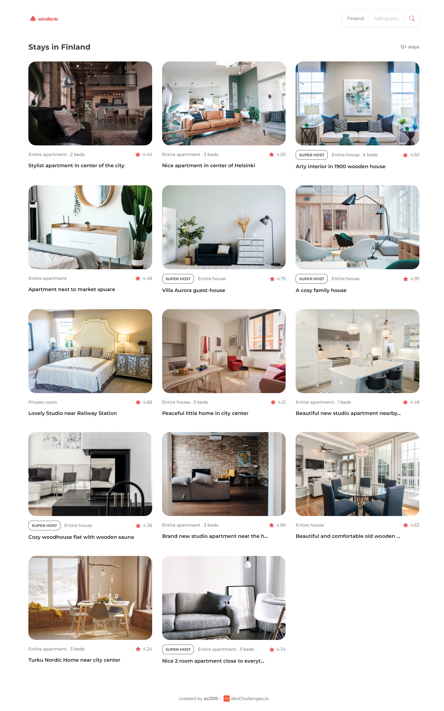

<h1 align="center">Windbnb</h1>

<div align="center">
   Solution for a challenge from  <a href="http://devchallenges.io" target="_blank">Devchallenges.io</a>.
</div>

<div align="center">
  <h3>
    <a href="https://windbnb-319.netlify.app/">
      Demo
    </a>
    <span> | </span>
    <a href="https://devchallenges.io/solutions/Mu3Jui2nXm2TeSTuwb6V">
      Solution
    </a>
    <span> | </span>
    <a href="https://devchallenges.io/challenges/3JFYedSOZqAxYuOCNmYD">
      Challenge
    </a>
  </h3>
</div>

<!-- TABLE OF CONTENTS -->

## Table of Contents

- [Overview](#overview)
  - [Built With](#built-with)
- [Features](#features)
- [How to use](#how-to-use)
- [Contact](#contact)

<!-- OVERVIEW -->

## Overview




Windbnb is a simple clone of airbnb website and is only frontend for now. Created using React and Redux.

- You can find live demo on [Netlify](https://windbnb-319.netlify.app/)
- I had a good experience and learnt a lot of things from this project
- I revamped my Redux skills with the improved workflows of Redux Toolkit with React. Further, this is the first project where I have used Test Driven Development.
- Having well guided tests from user stories is really helpful to structure a project.

### Built With


- [React](https://reactjs.org/)
- [Redux](https://redux.js.org/)
- [Sass](https://sass-lang.com/)

## Features


This application/site was created as a submission to a [DevChallenges](https://devchallenges.io/challenges) challenge. The [challenge](https://devchallenges.io/challenges/3JFYedSOZqAxYuOCNmYD) was to build an airbnb clone application to complete the given user stories.

## How To Use


To clone and run this application, you'll need [Git](https://git-scm.com) and [Node.js](https://nodejs.org/en/download/) (which comes with [npm](http://npmjs.com)) installed on your computer. From your command line:

```bash
# Clone this repository
$ git clone https://github.com/your-user-name/your-project-name

# Install dependencies
$ yarn install

# Run the app
$ yarn start
```

## Contact

- Website [Asidipta Chaudhuri](http://portfolio-asi309.vercel.app/)
- GitHub [@asi309](https://github.com/asi309)
